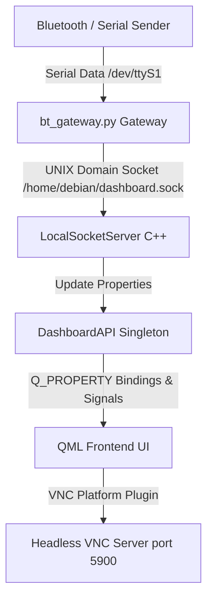

# Detailed Design Document: Automotive Cluster GUI Project

This document provides a detailed technical design specification for the **Automotive Cluster GUI** project. The system is designed to run on the **BeagleBone Black (ARMv7)** target hardware as a headless VNC server, receiving sensor and control data from a serial interface, forwarding it via a UNIX domain socket, and displaying it on a responsive, scalable Qt Quick/QML user interface.

---

## 1. System Overview & Architecture

The system uses a decoupled, event-driven architecture designed to minimize CPU overhead on resource-constrained embedded hardware. The data transmission path is structured as follows:



### Key Subsystems:
1. **Serial-to-Socket Gateway (`bt_gateway.py`)**: Runs as a daemon, listens to raw serial bytes from `/dev/ttyS1` at `9600` baud, structures packets into newline-terminated commands, and writes them to a UNIX domain socket.
2. **Local Socket Server (`LocalSocketServer`)**: A C++ UNIX domain socket listener that parses command strings, resolves escapes, and updates the `DashboardAPI`.
3. **Dashboard API (`DashboardAPI`)**: A C++ singleton class serving as the single source of truth for the vehicle state, exposing properties, setters, and change signals directly to QML.
4. **QML Frontend**: A responsive visual dashboard that binds to the `DashboardAPI` properties, rendering dials, indicators, and status overlays.
5. **Deployment & Service Manager**: Automated scripts and systemd services to configure, transfer, run, and monitor the applications on the BeagleBone Black.

---

## 2. Target Hardware Environment & Performance Optimization

The target platform is the **BeagleBone Black (BBB)** single-board computer:
- **Processor**: AM3358 1GHz ARM Cortex-A8 (Single Core)
- **Memory**: 512MB DDR3 RAM
- **OS**: Debian Linux (Headless, no local X11/Wayland display server)

### VNC Rendering & CPU Optimization
Because the BBB lacks a native GPU/display output and runs a headless OS, the Qt application renders using the **Qt VNC Platform Plugin**. QML rendering on a single-core Cortex-A8 is highly resource-intensive. To prevent CPU saturation and USB current brownouts (which cause the board to reboot), the following optimizations are implemented:
1. **Resolution Scaling**: The application window size is set to `800x480` (native) in `automotive-dashboard.service`. The container is designed at `1024x600` and dynamically scales using Qt's `Scale` transform to match the VNC display boundaries.
2. **Draw Rate Limit**: The platform parameter `-platform vnc:size=800x480:draw-rate=10` limits the VNC redraw rate to **10 FPS**. This caps CPU consumption at approximately 20-30% and stabilizes current draw.

---

## 3. Backend Integration Layer (C++)

The application backend bridges the Unix socket stream with the QML UI bindings.

### 3.1. DashboardAPI
[DashboardAPI.h](file:///home/channaveeragouda/bbb-dev/applications/AutomotiveCluster-BBB/DashboardAPI.h) & [DashboardAPI.cpp](file:///home/channaveeragouda/bbb-dev/applications/AutomotiveCluster-BBB/DashboardAPI.cpp) implement a singleton property sheet.

- **Reactive QML Binding**: Properties are declared using `Q_PROPERTY` with `READ` getters, `WRITE` setters, and `NOTIFY` signals.
- **Redundant Update Prevention**: Double values are filtered using `qFuzzyCompare` to avoid emitting redundant property changes.
- **Properties Sheet**:
  - *Gauges*: `throttle` (double, 0-100), `battery` (double, 0-100), `temperature` (double, °C).
  - *Transmission*: `gear` (QString: P, R, N, D).
  - *Doors*: `leftDoorOpen` (bool), `rightDoorOpen` (bool).
  - *Warnings*: `tirePressureLow` (bool), `seatbeltWarning` (bool), `cruiseControlActive` (bool), `electricalFault` (bool), `absWarning` (bool).
  - *Lighting & Indicators*: `leftIndicator` (bool), `rightIndicator` (bool), `brakePressed` (bool), `highBeam` (bool).
  - *System*: `bootActive` (bool).

### 3.2. LocalSocketServer
[LocalSocketServer.h](file:///home/channaveeragouda/bbb-dev/applications/AutomotiveCluster-BBB/LocalSocketServer.h) & [LocalSocketServer.cpp](file:///home/channaveeragouda/bbb-dev/applications/AutomotiveCluster-BBB/LocalSocketServer.cpp) listen on `/home/debian/dashboard.sock`.

- **Escaped Multi-Line Parsing**:
  - The client may batch commands with literal backslash-n (`\\n`) or carriage return (`\\r`) sequences.
  - The socket server replaces literal escape sequences with actual control characters before splitting by `\n` to process each command individually.
- **Command Dispatcher**: Parses incoming lines matching `key:value`. Sanitizes keys (lowercase) and values (uppercase gears, conversion of boolean `1`/`true` or doubles).

---

## 4. Frontend Presentation Layer (Qt/QML)

The user interface renders the vehicle status with custom visual components.

### 4.1. Root Window Layout (`Main.qml`)
[Main.qml](file:///home/channaveeragouda/bbb-dev/applications/AutomotiveCluster-BBB/Main.qml) sets up a window of size `800x480`. Inside, a `1024x600` canvas container is scaled down using:
```qml
property real scaleFactor: Math.min(width / 1024.0, height / 600.0)
transform: Scale {
    origin.x: 0; origin.y: 0
    xScale: root.scaleFactor
    yScale: root.scaleFactor
}
```
This ensures the GUI fits within the VNC viewport regardless of client resolution.

### 4.2. UI Components
All QML subcomponents are placed inside the [components](file:///home/channaveeragouda/bbb-dev/applications/AutomotiveCluster-BBB/components) directory:

1. **`ArcGauge.qml`**: Renders dynamic gauges (Throttle & Battery) using `PathAngleArc` on a 270-degree layout.
   - *Boot Animation*: Easing is disabled (`duration: 0`) during the boot sweep so that the manual 60fps timer handles the sweep accurately. Normal transitions use a `900ms` `Easing.InOutQuad`.
   - *Eyeball Blink Animation*: An opacity animation sequence flashes center text open-shut once on boot completed.
   - *Warning Flashing*: Battery levels `< 20%` trigger a `300ms` warning flasher.
2. **`CarStatus.qml`**: Centers a 2D vector blueprint (`car_blueprint.svg`) overlayed with:
   - Door open indicators (Rotated lines using `transform: Rotation` with a `250ms` animation).
   - Rear brake lights (red rectangles) active when `brakePressed == true`.
   - Front turn indicators (amber rectangles) flashing via a `500ms` interval timer.
   - Headlight highbeams (`headlight_beam.svg`).
   - SVG warning icons for low tire pressure, seatbelts, cruise control, electrical faults, and ABS issues.
3. **`GearSelector.qml`**: Renders transmission states P, R, N, D. The current active gear highlights in cyan (`#00FFCC`) with an active border.
4. **`TopHeader.qml`**: Displays the active date, time, and environment temperature.
   - If temperature drops below `3°C`, it displays an icy label and switches the weather icon to `weather_snow.svg` with a cyan color tone. Otherwise, it displays a sunny label with `weather_sunny.svg`.
5. **Overlays**: Screens for `SettingsScreen.qml`, `HelpScreen.qml`, and `AboutScreen.qml` open on demand, dimming the main cluster.

### 4.3. Boot Sequence Animation
Driven by QML timers inside `Main.qml`:
- **Stage 1 (Sweep Up)**: `bootTimer` runs at `16ms` intervals, sweeping both throttle and battery gauges from `0` to `100` over 75 ticks.
- **Stage 2 (Sweep Down)**: Sweeps throttle back to `0` while maintaining battery at `100`.
- **Stage 3 (Initialize)**: Triggers `bootFinishTimer` to turn off warning indicators, set default gear to `P`, and set `bootActive` to `false`.

---

## 5. Data Communications & Python Gateway

The Bluetooth serial stream translates into Unix domain socket payloads through [bt_gateway.py](file:///home/channaveeragouda/bbb-dev/applications/AutomotiveCluster-BBB/bt_gateway.py).

- **Serial Port Configuration**: Uses standard Python `termios` library to configure `/dev/ttyS1` at `9600` baud in raw `8N1` mode, disabling parity checks, signal handlers, and software flow control (`IXON`/`IXOFF`).
- **Framing Protocol**: Reads character-by-character from the serial interface, buffers characters until a carriage return (`\r`) or newline (`\n`) is encountered, and forwards the command to `/home/debian/dashboard.sock`.
- **Connection Guard**: Implements a reconnection loop that retries connection to the UNIX socket every 2 seconds if the C++ GUI server closes or restarts.

---

## 6. Orchestration & Deployment

The compilation and deployment system cross-compiles Qt and packages assets for transfer.

### 6.1. CMake Configurations
[CMakeLists.txt](file:///home/channaveeragouda/bbb-dev/applications/AutomotiveCluster-BBB/CMakeLists.txt) links Qt 6 Quick and Network modules. It lists QML module files, assets, and warning icons under `RESOURCES` so they are compiled directly into the binary's Qt Resource System (`qrc`).

### 6.2. Deployment Automation
- **Unified Deployment (`run_unified_deploy.py`)**:
  - Connects to the BeagleBone Black over SSH via `paramiko`.
  - Stops systemd services (`automotive-dashboard.service` and `bt-serial-gateway.service`) to release the executable files and socket locks, avoiding `Text file busy` errors.
  - Transfers the compiled ARM executable (`appAutomotiveCluster`), the gateway script (`bt_gateway.py`), systemd configurations, and setup shell script (`setup_board.sh`) via SCP.
  - Executes `/tmp/setup_board.sh` to move service files, apply executables flags, reload daemons, and restart services.
- **Board Provisioning (`setup_board.sh`)**: Moves service unit configurations to `/etc/systemd/system/`, reloads `systemctl daemon-reload`, and enables both gateway and dashboard services.

### 6.3. Systemd Service Unit Files
- [automotive-dashboard.service](file:///home/channaveeragouda/bbb-dev/applications/AutomotiveCluster-BBB/automotive-dashboard.service):
  - Sets libraries search paths: `LD_LIBRARY_PATH`, `QT_PLUGIN_PATH`, and `QML2_IMPORT_PATH` to local directory `/home/debian/qt6.11`.
  - Runs dashboard GUI app: `/home/debian/appAutomotiveCluster -platform vnc:size=800x480:draw-rate=10`.
- [bt-serial-gateway.service](file:///home/channaveeragouda/bbb-dev/applications/AutomotiveCluster-BBB/bt-serial-gateway.service):
  - Runs gateway service: `/usr/bin/python3 -u /home/debian/bt_gateway.py`.
